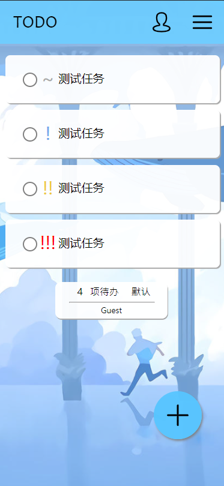

# 移动端 TodoMVC

 

 

## Chapter 1 项目简介

本项目为脚本程序设计课程的期末作业，参考了基本TodoMVC的功能设计而成。

主要针对中等屏幕大小的移动端设备，但移动端与电脑端均有合适的使用体验。

测试访问地址：https://xw1216.github.io

## Chapter 2 项目基本功能

本项目是前端程序，使用HTML，CSS，JavaScript完成，并具有以下基本功能：

- 新增、删除Todo条目，展示创建的Todo列表；
- 数据保存在本地`localStorage`中，刷新页面或重启浏览器数据均不会丢失；
- 可以通过菜单选项快速完成或重置所有Todo；
- 删除已经完成的Todo。

## Chapter 3 项目高级功能

在实现作业要求的基本要求外，本项目额外完成了以下功能：

- 每个Todo条目均可以设置优先级并突出展示；
- 有显示全部，高优先级，全部已完成，全部未完成四种过滤器，可以根据需要选择显示；
- 可以对已存在的Todo条目进行名称与优先级的更改；
- 拥有用户注册与登录功能，用户可以创建自己的Todo列表，其他用户无法看到；
- 部分交互针对电脑端与移动端均进行了适配；
- 展示项目数量统计；
- 快速新建Todo悬浮按钮；
- 重新设计的UI功能布局。

## Chapter 4 项目使用说明

本项目符合Todo应用的基本使用习惯，曾有Todo使用 经验的用户可以很快上手。

1. 单击右下角原型加号按钮可以快速创建Todo条目；
2. 创建条目时可以指定任务名称与优先级；
3. 点击确认按钮提交后Todo条目显示在页面中；
   也可以通过右上角关闭按钮与底部取消按钮取消当前操作；
4. 可以通过以下操作对Todo条目进行更改：
   - 电脑端
     左键单击更改Todo完成状态；
     中间单击唤出更改对话框；
     右键单击唤出删除按钮；
   - 移动端
     触摸单击更改Todo完成状态；
     按住向右滑动，条目颜色变为青色，唤出更改对话框；
     按住向左滑动，条目颜色变为红色，唤出删除按钮；
5. 删除按钮在被唤出后，经过一段时间后会自动隐藏。
   如需删除条目请在时限内点击删除，如误操作等待超时即可；
6. 顶部菜单按钮中有三组功能项：
   - 批量完成、重置Todo，单击后会对当前用户的所有Todo项进行操作；
   - 删除已完成，单击批量删除当前用户的所有处于完成状态的Todo项；
   - 筛选器，根据Todo任务的不同性质进行筛选查看；
7. 顶部菜单人像按钮单击进入登录界面；
8. 已有账户可以直接登录，页面主页面下方会显示当前登录的用户名；
9. 若无账户，可以单击两个输入框下的灰色按钮进行注册，根据页面提示信息进行输入的修改。

## Chapter 5 项目不足与改进

本项目在实现过程中发现了以下不足：

- 数据存储上限为5MB，当Todo数量过多时可能出现错误；
  后续可以使用IndexedDB等数据库进行存储；
- Todo项目的ID生成目前采用简单的全局计数器，可能出现计数问题；
  后续可以增加根据时间等变量进行uuid生成机制；
- 项目在Chrome及Microsoft Edge浏览器上测试良好，但在Firefox中会出现淡入淡出动画卡顿的情况。
  此外本项目没有对Internet Explorer进行适配。
  后续可以考虑在上述方向进行改进。
- 本项目对不同设备分辨率的表现不同，在屏幕像素宽度低于320px时，会出现布局紊乱。
  另外在宽屏设备上，一些条目的宽度会变得过大，影响视觉体验。
  后续可以考虑使用媒体查询的方式根据宽屏与小屏设备进行优化。

